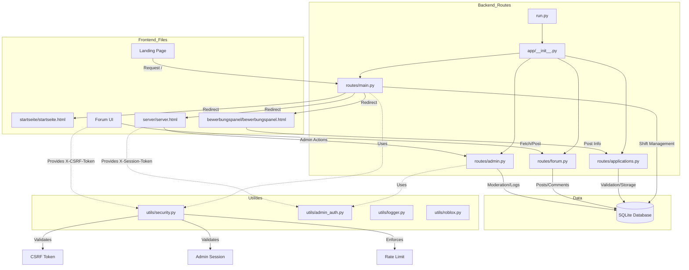

# Architecture & System Design

This document provides a high-level overview of the application's architecture, explaining the relationship between frontend and backend components, data flow, and security mechanisms.

## System Overview Diagram

The following diagram illustrates how the frontend interacts with the backend files and the flow of data.

## Backend Component Analysis

The backend is built with **Flask** and structured into modular blueprints.

### Core Files

*   **`run.py`**
    *   **Function**: Entry point of the application.
    *   **Responsibility**: Starts the Flask server (`app.run`), binding it to the configured host and port.

*   **`app/__init__.py`**
    *   **Function**: Application Factory.
    *   **Responsibility**: Initializes the Flask app, configures the database (`SQLAlchemy`), sets up logging, and registers Blueprints (routes).
    *   **Security**: Automatically injects strict **HTTP Security Headers** (CSP, X-Frame-Options, etc.) into every response to prevent XSS and Clickjacking.

### Route Modules (`app/routes/`)

*   **`main.py`**
    *   **Function**: General purpose handler.
    *   **Responsibility**: 
        *   Manages redirects to static frontend pages (e.g., `/` -> `/startseite/startseite.html`).
        *   Provides system status APIs (uptime, version).
        *   **Shift Management**: Handles starting/ending shifts for admins, recording duration in the database.
        *   **CSRF**: Generates and distributes unique CSRF tokens for form security.
        *   **Roblox Integration**: Resolves Roblox usernames via API.

*   **`applications.py`** (Assumed based on naming)
    *   **Function**: Career/Application system.
    *   **Responsibility**: Handles incoming job applications, validates user input, and stores them in the `Application` database model.

*   **`forum.py`** (Assumed based on naming)
    *   **Function**: Community Forum.
    *   **Responsibility**: Manages threads, posts, and comments. Likely integrates with `utils/moderation.py` to filter content.

*   **`admin.py`** (Assumed based on naming)
    *   **Function**: Administration Panel.
    *   **Responsibility**: Back-office operations, viewing logs, managing users/bans, and system configuration. Requires high-level authentication.

### Utility Modules (`app/utils/`)

*   **`security.py`**
    *   **Function**: Security Enforcer.
    *   **Responsibility**:
        *   **CSRF Protection**: Generates and validates cryptographic tokens bound to IP addresses to prevent Cross-Site Request Forgery.
        *   **Rate Limiting**: Implements adaptive rate limits (stricter for guests, looser for admins) to prevent DoS attacks.
        *   **Session Validation**: Verifies `X-Session-Token` for admin actions, ensuring sessions haven't expired or been hijacked from a different IP.
        *   **IP Hashing**: Anonymizes user IP addresses before storage for privacy compliance (`sha256`).

*   **`admin_auth.py`**
    *   **Function**: Authentication Logic.
    *   **Responsibility**: Handles credential verification (likely rotating credentials or secure password checks) for admin access.

*   **`sanitize.py`**
    *   **Function**: Input Sanitization.
    *   **Responsibility**: Cleanses user input to prevent Injection attacks (SQLi) or XSS payloads before data enters the system.

## Data & Validation Flow

1.  **Request Initiation**: A user performs an action (e.g., submits a form) on the frontend.
2.  **Security Check**:
    *   The browser sends an `X-CSRF-Token` (fetched via `/api/csrf-token`).
    *   `security.py` validates this token against the user's IP hash.
    *   If the rate limit is exceeded, the request is rejected (429 Too Many Requests).
3.  **Route Processing**:
    *   The specific Blueprint (e.g., `applications.py`) receives the data.
    *   **Validation**: The route checks if required fields exist and conform to expected formats (using `sanitize.py`).
4.  **Database Interaction**:
    *   Valid data is committed to the SQLite database via `models.py`.
5.  **Response**: The server returns a JSON response or redirect, often with updated Security Headers from `__init__.py`.
